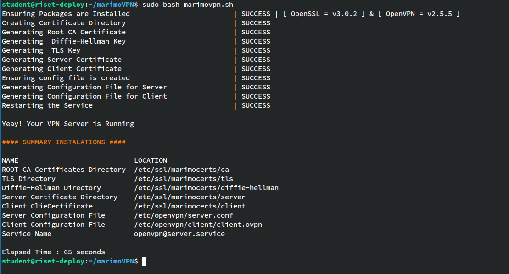
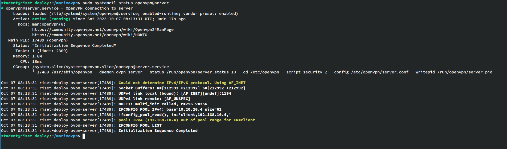
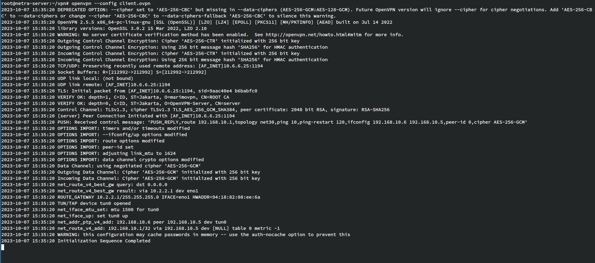

# marimoVPN

marimoVPN is a simple automation tool for setting up an OpenVPN Server. It's Easy to setup OpenVPN Server using marimoVPN because the tool is faster. Your VPN Server will be up and running in just a few seconds.

## Download marimoVPN
- Clone this Repository <br>
```git clone https://github.com/baguskokow/marimoVPN.git```

## Using marimoVPN
- Ensure the OpenSSL and OpenVPN packages are installed in your server
- Copy the "config.txt" file from the "examples" directory <br>
```cp examples/config.txt .```
- Define your VPN server configuration. See the example below <br>
```
port = 1194
protocol = udp
ip server = 10.6.6.25
subnet tunnel = 192.168.10.0 255.255.255.0
```
- Running <br>
```sudo bash marimovpn.sh``` <br>
<b>Note</b> : You must use a privileged user (root user) <br><br>


- Verify the OpenVPN service<br>
```sudo systemctl status openvpn@server```<br><br>


## Client Testing


## Supported Linux Distros
- Ubuntu

## Troubleshoting
If you get an error during installation., you can check the log at /var/log/marimo.log.
